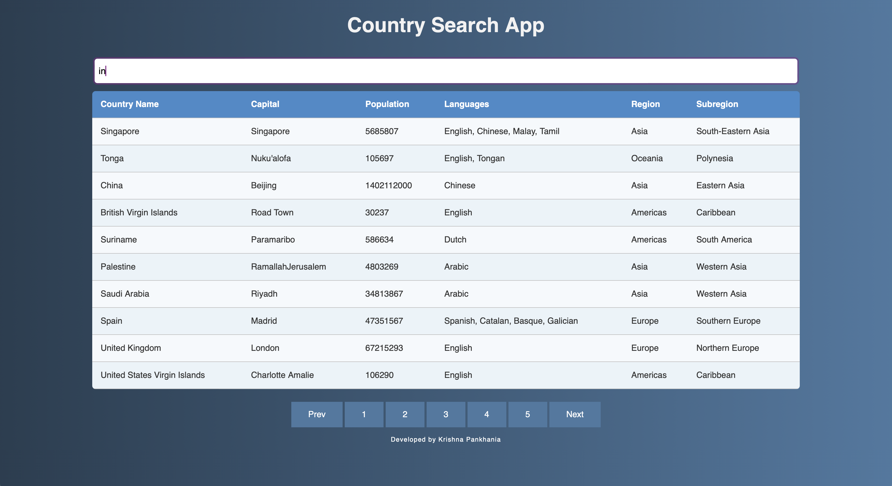

# Country Search App

This React + TypeScript demo application allows users to search for country details using an external API.

## Components

### 1. `App`

The main component responsible for rendering other components and managing the application state.

### 2. `StateProvider`

A context provider component that manages the global state of the application. It provides the `useStateContext` hook to access the state throughout the application.

### 3. `Search`

A component that allows users to search for countries by entering the country name in an input field. It triggers a search when the user stops typing or when the user clicks a specific key combination.

### 4. `Results`

A component that displays the search results based on the user's input. It renders the details of each country, including its name, capital, population, languages spoken, region, and subregion.

### 5. `Pagination`

A component that handles pagination for displaying search results. It allows users to navigate between pages of search results.

## API

The application fetches country details from the [Rest Countries API](https://restcountries.com/v3.1/). It utilizes the `/name/{name}` endpoint to search for countries based on their names.

## Screenshots

## How to run?

To run the Country Search App locally, follow these steps:

1. Clone this repository to your local machine using `git clone https://github.com/krishnapankhania/country-search-app`.
2. Navigate to the project directory: `cd country-search-app`.
3. Install dependencies by running `npm install` or `yarn install`.
4. Start the development server: `npm start` or `yarn start`.
5. Open your browser and go to `http://localhost:3000` to view the application.
